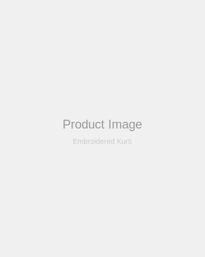

# Image Folder Setup - Action Steps

## What You Now Have

✅ Local `/images/` folder with organized structure:
```
images/
├── products/
│   ├── kurtis/          → Kurti & Kurta images
│   ├── sarees/          → Saree images
│   ├── suits/           → Suit & Salwar images
│   └── dresses/         → Dress images
└── banners/             → Hero/promo banners
```

✅ All HTML files updated to use local images
✅ Complete IMAGE-MANAGEMENT.md guide

---

## 📤 Upload to Hostinger (IMPORTANT!)

### Step 1: Upload Images Folder
1. Login to Hostinger → **File Manager**
2. Navigate to `/public_html/`
3. **Upload entire `images` folder** (with all subfolders)
   - Drag `images/` folder from your computer
   - OR create folder structure manually and upload files

### Step 2: Verify Upload
1. Refresh browser at: https://aarzah.com
2. Check that product images load correctly
3. Verify banners display properly

### What Happens
- Images served from: `https://aarzah.com/images/products/category/file.jpg`
- Site becomes **independent** of external image sources (Unsplash)
- **Faster loading** (images on your server)
- **Production ready** with local assets

---

## 🎯 Current Image Map

### Products Currently Using
| Product | Folder | File |
|---------|--------|------|
| Embroidered Kurti | kurtis | embroidered-kurti.svg |
| Printed Saree | sarees | printed-saree.svg |
| Palazzo Suit | suits | palazzo-suit.svg |
| Casual Dress | dresses | casual-dress.svg |
| Designer Silk Kurti | kurtis | embroidered-kurti.svg (reused) |
| Printed Kurta | kurtis | embroidered-kurti.svg (reused) |

### Banners Currently Using
| Banner | Folder | File |
|--------|--------|------|
| Summer Collection | banners | summer-collection.svg |

---

## 🖼️ Adding Real Product Photos

### To Replace Placeholder Images

1. **Take/source product photos**
   - Recommended: 400px × 500px JPG
   - Keep file size <200KB

2. **Upload to correct folder**
   ```
   images/products/kurtis/embroidered-kurti.jpg
                           ↓
                    Replace this file
   ```
   
3. **Or add new product image**
   ```
   images/products/kurtis/printed-kurti.jpg
                           ↑
                    New file name
   ```

4. **Update HTML if needed**
   - Admin panel → Add Product → Paste path
   - Or directly edit HTML if static

---

## WordPress WooCommerce Ready

### During Migration
Your image structure is **fully compatible**:

```
Static Site (Current):
/images/products/kurtis/embroidered-kurti.jpg

Automatic during WooCommerce import:
/wp-content/uploads/2024/images/.../embroidered-kurti.jpg
                             ↑
                   WooCommerce converts automatically
```

### No Manual Work
- Plugin handles image migration
- Paths convert automatically
- Database references update

---

## ✅ Checklist Before Upload

- [ ] Images folder exists locally at: `c:\Users\prash\Documents\aarzah-site\images\`
- [ ] Has 4 subfolders: `kurtis/`, `sarees/`, `suits/`, `dresses/`
- [ ] Banner folder exists: `banners/`
- [ ] All files uploaded to `/public_html/images/`
- [ ] Test site loads: https://aarzah.com
- [ ] Product images display correctly
- [ ] Banner shows on homepage

---

## File Paths Reference

### Static Site (Current)
```
Local:  c:\Users\prash\Documents\aarzah-site\images\products\kurtis\embroidered-kurti.svg
Server: /public_html/images/products/kurtis/embroidered-kurti.svg
URL:    https://aarzah.com/images/products/kurtis/embroidered-kurti.svg
Code:   
```

### Admin Panel Adding Product
```
Image URL field: images/products/category/filename.jpg
System stores: {image: "images/products/category/filename.jpg"}
Works on: Static site AND WordPress
```

---

## Benefits of This Setup

✅ **Independence** - No external image dependency
✅ **Speed** - Images on your server (faster CDN)
✅ **Control** - Full image management
✅ **Scalability** - Easy to add hundreds of products
✅ **WooCommerce Ready** - Direct migration compatible
✅ **Backup Friendly** - All content in one place
✅ **SEO** - Local hosting improves crawlability
✅ **Cost** - No download bandwidth from external sources

---

## Next Steps

1. **Upload images folder to Hostinger** ← Priority #1
2. Test site at https://aarzah.com
3. Replace placeholder SVGs with real JPG product photos (optional)
4. Add more images to folders as you add products
5. When ready: Migrate to WordPress (images migrate automatically)

---

**IMPORTANT:** Without uploading the `/images/` folder, your site will show broken image placeholders after Hostinger deployment!

Would you like help with:
- Uploading images to Hostinger?
- Finding product photos to use?
- Optimizing image file sizes?
- Setting up automatic backup?
